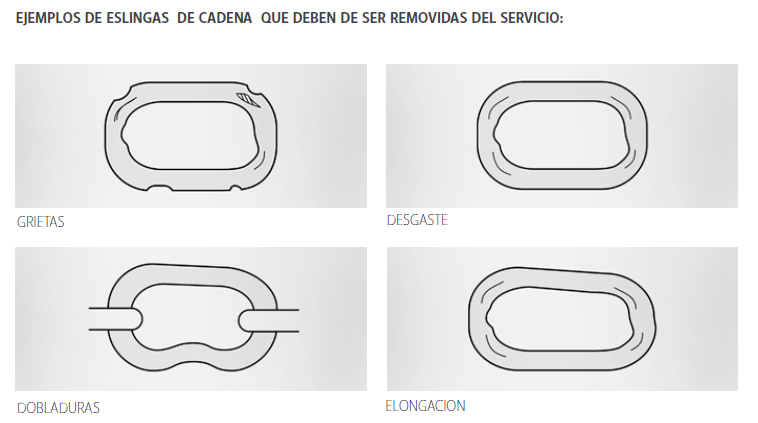

Las eslingas de cadena deben de retirarse de servicio si se presenta lo siguiente:

- Placa ilegible o faltante.

- Cadena o Accesorios rotos o con grietas.

- Si no se sabe la capacidad estipulada de la eslinga así como si falta o no el legible la etiqueta identificadora de la eslinga.

- Desgaste superior al 10% en cualquier parte de la cadena o de los accesorios.

- Elongación superior al 5% en los eslabones de la cadena o los accesorios.

- Dobladuras o deformación en los eslabones de la cadena o los accesorios.

- Si cuenta con corrosión u oxido excesivo.

- Si los eslabones de la cadena o los accesorios no se pueden mover libremente.

- Salpicaduras de soldadura.

- Nudos en cualquier parte de la eslinga.

- Decoloración en cualquier parte de la eslinga lo cual indica daño por contacto con químicos.

- Accesorios en mal estado por desgaste, corrosión, roturas y deformaciones.

- Para Ganchos vea ASME B30.10 criterios de remoción.

- Para Accesorios vea ASME B.30.26 criterios de remoción.

- Cualquier condición que cause duda acerca de la capacidad de carga de la eslinga.

