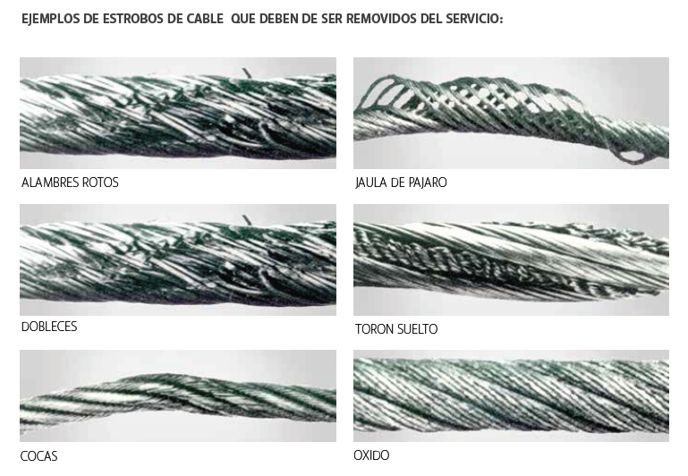

Los estrobos de cabe de acero deben de retirarse de servicio si se presenta lo siguiente:

- Placa ilegible o faltante.

- Mas de 10 alambres rotos en un paso del cable o 5 alambres rotos en un solo toron de un paso del cable.

- Dobladuras en el cable.

- Cocas, Jaulas de pájaro o torones sueltos en el estrobo.

- Desgaste excesivo.

- Si no se sabe la capacidad estipulada de la eslinga así como si falta o no el legible la etiqueta identificadora de la eslinga.

- Si cuenta con corrosión u oxido excesivo.

- Nudos en cualquier parte del estrobo.

- Accesorios en mal estado por desgaste, corrosión, roturas y deformaciones.

- Para Ganchos vea ASME B30.10 criterios de remoción.

- Para Accesorios vea ASME B.30.26 criterios de remoción.

- Cualquier condición que cause duda acerca de la capacidad de carga del estrobo.

